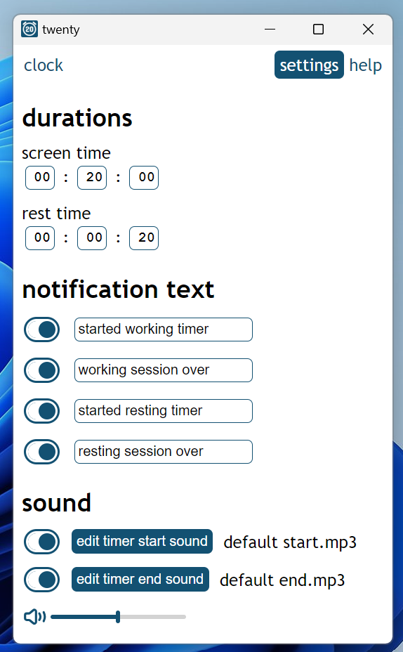

# Twenty

a customizable timer to keep track of the 20 20 20 rule

## installation

download and extract this:
 - [windows](https://www.dropbox.com/scl/fi/nygh1dtu2qc3ho0yicypw/twenty-win32-x64.zip?rlkey=pe1nav34ljkkwslt6wrvu6xxb&st=4n4jdgst&dl=1)

open the extracted folder and run `twenty.exe`

to **uninstall**, simply delete the extracted folder

## preview

